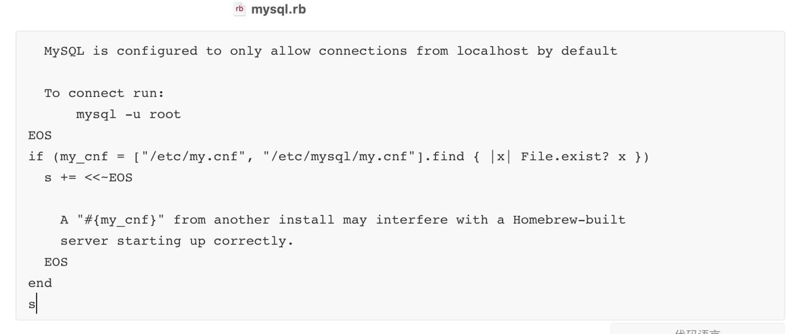
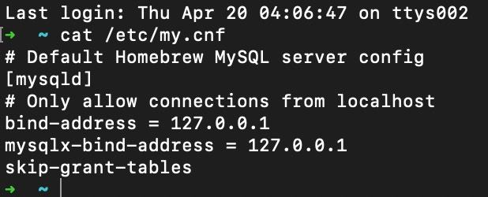

# MacOS（本机）- MySql


[toc]
- [MacOS（本机）- MySql](#macos本机--mysql)
  - [1、卸载 和 删除 MySql](#1卸载-和-删除-mysql)
    - [1.1、清除程序体](#11清除程序体)
    - [1.2、清除数据库物理实体文件](#12清除数据库物理实体文件)
  - [2、多种方式安装和管理 MySql](#2多种方式安装和管理-mysql)
    - [2.1、用 brew 容器管理 MySql❤️](#21用-brew-容器管理-mysql️)
    - [2.2、从官网下载 MySql 直接安装在本机（未验证）](#22从官网下载-mysql-直接安装在本机未验证)
    - [2.3、用 `Macport`/`brew`/`MySql` 官网下载直接安装到本机的区别](#23用-macportbrewmysql-官网下载直接安装到本机的区别)
    - [2.4、查询本机的 MySql 的版本号，以及用什么容器进行下载管理](#24查询本机的-mysql-的版本号以及用什么容器进行下载管理)
    - [2.5、关于版本号](#25关于版本号)
    - [2.6、查询本机的 MySql 的 PID](#26查询本机的-mysql-的-pid)
    - [2.7、`mysql`与`mysqld`](#27mysql与mysqld)
    - [2.8、登录 Mysql](#28登录-mysql)
    - [2.9、MySql 常见报错分析（欢迎补充）❤️](#29mysql-常见报错分析欢迎补充️)
  - [3、关于 Mysql 配置文件 `my.cnf`](#3关于-mysql-配置文件-mycnf)
    - [3.1、修改 Mysql 配置文件 `my.cnf` 的脚本](#31修改-mysql-配置文件-mycnf-的脚本)
  - [4、查询本机的 MySql 的路径](#4查询本机的-mysql-的路径)
    - [4.1、安装路径](#41安装路径)
    - [4.2、安装目录](#42安装目录)
    - [4.3、存放数据的物理文件目录](#43存放数据的物理文件目录)
  - [5、 MySql 用户](#5-mysql-用户)
    - [5.1、显示全部用户](#51显示全部用户)
    - [5.2、显示当前用户](#52显示当前用户)
    - [5.3、新建用户](#53新建用户)
    - [5.4、删除新建的用户](#54删除新建的用户)
    - [5.5、误删root用户的解决办法](#55误删root用户的解决办法)
    - [5.6、授权给新建的用户](#56授权给新建的用户)
    - [5.7、设置与更改用户密码](#57设置与更改用户密码)
    - [5.8、更改 MySql 数据库用户名](#58更改-mysql-数据库用户名)
  - [6、MySql 密码](#6mysql-密码)
    - [6.1、MySql 忘记密码🌛](#61mysql-忘记密码)
    - [6.2、通过修改 MySql 的配置文件`my.cnf`来修改密码【附脚本】❤️](#62通过修改-mysql-的配置文件mycnf来修改密码附脚本️)
    - [6.3、MySql 无密码状态的密码设置](#63mysql-无密码状态的密码设置)
    - [6.4、MySql 的密码策略❤️](#64mysql-的密码策略️)
  - [7、查看 MySql 数据库物理文件存放位置❤️](#7查看-mysql-数据库物理文件存放位置️)
  - [8、命令行建库（test\_jobs）建表（user\_time\_login\_stat）](#8命令行建库test_jobs建表user_time_login_stat)
  - [9、MySql 日志](#9mysql-日志)
    - [9.1、Mysql 有以下几种日志👇🏻](#91mysql-有以下几种日志)
    - [9.2、日志的查询](#92日志的查询)
  - [10、MySql 和 Shell 命令的互相调用](#10mysql-和-shell-命令的互相调用)
    - [10.1、在 Shell 中执行 MySql 相关查询](#101在-shell-中执行-mysql-相关查询)
    - [10.2、在 MySql 命令行中执行 Shell 相关命令](#102在-mysql-命令行中执行-shell-相关命令)
    - [10.3、MySql 执行外部`x.sql`](#103mysql-执行外部xsql)
  - [11、命令行使用 MySql](#11命令行使用-mysql)
    - [11.1、 显示所有的数据库（注意：`databases` 是复数末尾要加`s`）](#111-显示所有的数据库注意databases-是复数末尾要加s)
    - [11.2、删除名为`test`的数据库](#112删除名为test的数据库)
    - [11.3、创建名为`test`的数据库](#113创建名为test的数据库)
    - [11.4、使用用名为`test`的数据库（可以不用 `;`结尾）](#114使用用名为test的数据库可以不用-结尾)
    - [11.5、查看数据库`test`名下有什么表（当前只有一张名为`user`的表）](#115查看数据库test名下有什么表当前只有一张名为user的表)
    - [11.6、查看数据表`user`的表结构](#116查看数据表user的表结构)
  - [12、一些插件](#12一些插件)

*资料来源*

[C语言中文网/MySQL查看用户权限](http://c.biancheng.net/view/7498.html)

## 1、卸载 和 删除 MySql

*资料来源*

[如何清理 brew 安装的 mysql ？mysql 的数据文件在哪里？](https://newsn.net/say/brew-uninstall-mysql.html)

### 1.1、清除程序体

*用 brew 管理*

```bash
brew remove mysql 
```

或者 

```bash
brew uninstall mysql
```

```bash
brew cleanup
```

*直接安装在 MacOS 上，清除残留*

```bash
sudo rm /usr/local/MySQL
sudo rm -rf /usr/local/MySQL*
sudo rm -rf /Library/StartupItems/MySQLCOM
sudo rm -rf /Library/PreferencePanes/My*
edit /etc/hostconfig and remove the line MySQLCOM=-YES-
rm -rf ~/Library/PreferencePanes/My*
sudo rm -rf /Library/Recipts/MySQL*
sudo rm -rf /Library/Receipts/MySQL*
sudo rm -rf /private/var/db/receipts/MySQL*
sudo rm -rf /var/db/receipts/com.mysql.*
```

### 1.2、清除数据库物理实体文件

*1、先查询数据库物理实体文件路径*

```mysql
mysql> show global variables like "%datadir%" ;  
+---------------+--------------------------+
| Variable_name | Value          |
+---------------+--------------------------+
| datadir    | /opt/homebrew/var/mysql/ |
+---------------+--------------------------+

1 row in set (0.02 sec)
```

*2、删除数据库物理实体文件*

```bash
rm -r /opt/homebrew/var/mysql
```

## 2、多种方式安装和管理 MySql

### 2.1、用 brew 容器管理 MySql❤️

```bash
brew install mysql // 安装mysql
brew uninstall mysql 或者 brew remove mysql // 卸载mysql
brew info mysql // mysql的安装信息

brew services restart mysql // 重启MySQL
brew services stop mysql // 关闭MySQL
brew services start mysql // 启动MySQL
```

```bash
(sudo) mysql.server stop // 关闭MySQL
(sudo) mysql.server start // 启动MySQL
(sudo) mysql.server restart // 重启MySQL
```

```bash
运行brew service start mysql 可以后台启动mysql
运行(sudo) mysql.server start 前台启动mysql
```


### 2.2、从官网下载 MySql 直接安装在本机（未验证)

```javascript
open https://juejin.cn/post/6844903956305412104
```

### 2.3、用 `Macport`/`brew`/`MySql` 官网下载直接安装到本机的区别

*Macport 和 brew 作为容器管理着 MySql 的生命周期，那么对于 MySql 的服务开启\关闭、重启 等的命令方式不一样*

```
比如：如果直接在终端以官网下载部署到Mac系统这种方式的命令找出 MySql 的 pid ，对其进行kill -9 关闭是无效的（因为有中间过程值，关闭了又会被激活）
```

*关闭服务，即停止本机上任何对 MySql 的调用。MySql 的调用前提一定要激发其对外提供服务*

*因为安全原因，MySql的某些版本对于忘记密码的操作不一样，也就是说可能都不存在教程上的文件和路径*

### 2.4、端口号

*查看MySQL默认端口号*

```mysql
mysql> show global variables like 'port';
+---------------+-------+
| Variable_name | Value |
+---------------+-------+
| port          | 0     |
+---------------+-------+
1 row in set (0.04 sec)
```

### 2.5、关于版本号

*MySql 忽然从5.7升级到了8.0，直接跳过了6和7。即，版本号码：5.5/5.6/5.7/8.0*

*MySql-8.0 以前的版本需要使用命令'brew link',不主动link的话，连mysql命令行都不能使用。即使能使用mysql命令行的话，也是会提示不能登陆，缺少caching_sha2_password.so文件*

*无奈之下，就只能选择清理 MySql 了*

**以 MySql-5.7 版本为例，即：**

```bash
 brew install mysql@5.7
 brew link mysql@5.7 --force
 brew services start mysql@5.7
 mysql -uroot -p
```

**查询本机的 MySql 的版本号，以及用什么容器进行下载管理**

*在 bash 环境下查询*

```bash
➜  ~ mysql --version
mysql  Ver 8.0.32 for macos13.0 on arm64 (Homebrew)
```

*在 Mysql 环境下查询*

```mysql
mysql> select version();
+-----------+
| version() |
+-----------+
| 8.0.32    |
+-----------+
1 row in set (0.00 sec)
```

### 2.6、查询本机的 MySql 的 PID

*👇🏻能和"活动监视器"的数据对得上*

```bash
lsof -nP -i | grep mysql   
```

### 2.7、`mysql`与`mysqld`

*区别*

```
mysqld 是服务端程序
mysql是命令行客户端程序
```

*关闭`mysqld`进程*

```
mysqld 的守护进程 mysqld_safe ,也是 mysqld 的父进程（守护进程）
```

### 2.8、登录 Mysql

*查询当前登录账户*

```mysql
mysql> select user();
```

*以系统登录名进行登录*

**注意：只有在 Mysql 的配置文件 `my.cnf`里面 开放了 `skip-grant-tables` 才可以免密登录，当然此时的端口为0**

```mysql
mysql -p 
或者
mysql
```

*以root账户登录*

```mysql
mysql -u root -p
```

### 2.9、MySql 常见报错分析（欢迎补充）❤️

#### 2.9.1、ERROR 2002 (HY000)

```mysql
【 mysql 服务没有启动】
登录 root 账户
mysql -u root -p
返回 →
ERROR 2002 (HY000): Can't connect to local MySQL server through socket '/tmp/mysql.sock' (2)
错误原因：服务未启动。
因为通过命令验证brew services stop mysql，返回 Warning: Service `mysql` is not started.

【mysql 账密错误】
那么开启服务。
如果密码有误，则报错：ERROR 1045 (28000): Access denied for user 'root'@'localhost' (using password: YES)
```

#### 2.9.2、ERROR 1290 (HY000)

```mysql
相关说明：
MySQL`--skip-grant-tables`选项用于在不加载授权表的情况下启动 MySQL 服务器
--skip-grant-tables当该选项处于活动状态时，与帐户管理相关的 SQL 语句将被禁用
例如，您不能使用ALTER USERorSET PASSWORD语句。运行这样的语句会导致ERROR 1290

解决方案：
mysql> FLUSH PRIVILEGES;
或者，重启 Mysql 服务：
brew services restart mysql

举例：删除系统 root 账户
mysql> DROP USER 'root'@'localhost';
ERROR 1290 (HY000): The MySQL server is running with the --skip-grant-tables option so it cannot execute this statement

mysql>  FLUSH privileges;
Query OK, 0 rows affected (0.02 sec)

mysql> DROP USER 'root'@'localhost';
Query OK, 0 rows affected (0.02 sec)
```

#### 2.9.3、ERROR 1227 (42000)

```mysql
mysql> FLUSH privileges;
ERROR 1227 (42000): Access denied; you need (at least one of) the RELOAD privilege(s) for this operation
```

#### 2.9.5、ERROR 1044 (42000)

```mysql
mysql> create database go_db;
ERROR 1044 (42000): Access denied for user 'Jobs'@'localhost' to database 'go_db'
```

## 3、关于 Mysql 配置文件 `my.cnf`

```
用 brew 管理的 mysql 有2个配置文件：
1、brew_mysql 的配置文件`/opt/homebrew/Cellar/mysql/"8.0.32"/.bottle/etc/my.cnf`
2、系统的 mysql 配置文件 `/etc/my.cnf`
brew_mysql 的配置文件 需要映射到 系统的 mysql 配置文件 方可生效
```

### 3.1、配置文件的加载顺序

*资料来源*

[MySQL修改启动端口无效](https://blog.csdn.net/luxiaoruo/article/details/113730007)

[MySQL服务读取参数文件my.cnf的规律研究探索](https://www.cnblogs.com/kerrycode/p/8582249.html)

**如果在启动 Mysql的时候未指定 `my.cnf ` 那么他将从左至右依次去找寻` /etc/my.cnf` `/etc/mysql/my.cnf` `/opt/homebrew/etc/my.cnf ` `~/.my.cnf `**

```bash
➜  ~ mysql --help | grep 'my.cnf'
                      order of preference, my.cnf, $MYSQL_TCP_PORT,
/etc/my.cnf /etc/mysql/my.cnf /opt/homebrew/etc/my.cnf ~/.my.cnf 
```

### 3.2、修改 Mysql 配置文件 `my.cnf` 的脚本

*温馨提示：先修改再运行*

```shell
# !/bin/bash

echo '关闭本机通过 brew 方式安装的 MySql 服务'
brew services stop mysql
mysql.server stop

echo '本机通过 brew 形式安装的 MySql 安装目录'
brew list mysql
# 不出意外，会对外输出 /opt/homebrew/Cellar/mysql
mysql --version

read -p "请输入本机的 Mysql 版本号，以回车结束。默认8.0.32:" mysqlVersion
if [[ $mysqlVersion = "" ]];then
    mysqlVersion="8.0.32"
fi
fileCopy_fullname=$"/opt/homebrew/Cellar/mysql/"${mysqlVersion}"/.bottle/etc/my.cnf"
echo "fileCopy_fullname:"$fileCopy_fullname

# 直接追加写入
cat>>${fileCopy_fullname}<<EOF
# 这里写入需要修改的配置信息
gtid_mode=ON  
log-slave-updates=1  
enforce-gtid-consistency=1  
skip-grant-tables  

EOF

code $fileCopy_fullname
read -p "检查完毕并保存:通过brew管理的Mysql配置文件【my.cnf】" 
sudo cp $fileCopy_fullname /etc/my.cnf
code /etc/my.cnf
brew services restart mysql 

echo "不需要验证密码，直接登录 mysql"
mysql -p   
```

### 3.3、一些参数

`skip_networking`该变量控制是否关闭TCP/IP连接，默认允许，如果启用，则只能本地socker连接。如果只是本地客户端连接，强烈建议开启。

## 4、查询本机的 MySql 的路径

###  4.1、安装路径

```bash
➜  ~ whereis mysql
mysql: /opt/homebrew/bin/mysql /opt/homebrew/share/man/man1/mysql.1
```

### 4.2、安装目录

```bash
➜  ~ brew list mysql

/opt/homebrew/Cellar/mysql/8.0.32/.bottle/etc/my.cnf
/opt/homebrew/Cellar/mysql/8.0.32/bin/comp_err
/opt/homebrew/Cellar/mysql/8.0.32/bin/ibd2sdi
/opt/homebrew/Cellar/mysql/8.0.32/bin/innochecksum
/opt/homebrew/Cellar/mysql/8.0.32/bin/my_print_defaults
/opt/homebrew/Cellar/mysql/8.0.32/bin/myisam_ftdump
/opt/homebrew/Cellar/mysql/8.0.32/bin/myisamchk
/opt/homebrew/Cellar/mysql/8.0.32/bin/myisamlog
/opt/homebrew/Cellar/mysql/8.0.32/bin/myisampack
/opt/homebrew/Cellar/mysql/8.0.32/bin/mysql
/opt/homebrew/Cellar/mysql/8.0.32/bin/mysql.server
/opt/homebrew/Cellar/mysql/8.0.32/bin/mysql_client_test
/opt/homebrew/Cellar/mysql/8.0.32/bin/mysql_config
/opt/homebrew/Cellar/mysql/8.0.32/bin/mysql_config_editor
/opt/homebrew/Cellar/mysql/8.0.32/bin/mysql_keyring_encryption_test
/opt/homebrew/Cellar/mysql/8.0.32/bin/mysql_migrate_keyring
/opt/homebrew/Cellar/mysql/8.0.32/bin/mysql_secure_installation
/opt/homebrew/Cellar/mysql/8.0.32/bin/mysql_ssl_rsa_setup
/opt/homebrew/Cellar/mysql/8.0.32/bin/mysql_tzinfo_to_sql
/opt/homebrew/Cellar/mysql/8.0.32/bin/mysql_upgrade
/opt/homebrew/Cellar/mysql/8.0.32/bin/mysqladmin
/opt/homebrew/Cellar/mysql/8.0.32/bin/mysqlbinlog
/opt/homebrew/Cellar/mysql/8.0.32/bin/mysqlcheck
/opt/homebrew/Cellar/mysql/8.0.32/bin/mysqld
/opt/homebrew/Cellar/mysql/8.0.32/bin/mysqld_multi
/opt/homebrew/Cellar/mysql/8.0.32/bin/mysqld_safe
/opt/homebrew/Cellar/mysql/8.0.32/bin/mysqldump
/opt/homebrew/Cellar/mysql/8.0.32/bin/mysqldumpslow
/opt/homebrew/Cellar/mysql/8.0.32/bin/mysqlimport
/opt/homebrew/Cellar/mysql/8.0.32/bin/mysqlpump
/opt/homebrew/Cellar/mysql/8.0.32/bin/mysqlrouter
/opt/homebrew/Cellar/mysql/8.0.32/bin/mysqlrouter_keyring
/opt/homebrew/Cellar/mysql/8.0.32/bin/mysqlrouter_passwd
/opt/homebrew/Cellar/mysql/8.0.32/bin/mysqlrouter_plugin_info
/opt/homebrew/Cellar/mysql/8.0.32/bin/mysqlshow
/opt/homebrew/Cellar/mysql/8.0.32/bin/mysqlslap
/opt/homebrew/Cellar/mysql/8.0.32/bin/mysqltest
/opt/homebrew/Cellar/mysql/8.0.32/bin/mysqltest_safe_process
/opt/homebrew/Cellar/mysql/8.0.32/bin/mysqlxtest
/opt/homebrew/Cellar/mysql/8.0.32/bin/perror
/opt/homebrew/Cellar/mysql/8.0.32/bin/zlib_decompress
/opt/homebrew/Cellar/mysql/8.0.32/docs/sample_mysqlrouter.conf
/opt/homebrew/Cellar/mysql/8.0.32/homebrew.mxcl.mysql.plist
/opt/homebrew/Cellar/mysql/8.0.32/homebrew.mysql.service
/opt/homebrew/Cellar/mysql/8.0.32/include/mysql/ (16 files)
/opt/homebrew/Cellar/mysql/8.0.32/lib/libmysqlclient.21.dylib
/opt/homebrew/Cellar/mysql/8.0.32/lib/libmysqlharness.1.dylib
/opt/homebrew/Cellar/mysql/8.0.32/lib/libmysqlharness_stdx.1.dylib
/opt/homebrew/Cellar/mysql/8.0.32/lib/libmysqlharness_tls.1.dylib
/opt/homebrew/Cellar/mysql/8.0.32/lib/libmysqlrouter.1.dylib
/opt/homebrew/Cellar/mysql/8.0.32/lib/libmysqlrouter_connection_pool.1.dylib
/opt/homebrew/Cellar/mysql/8.0.32/lib/libmysqlrouter_destination_status.1.dylib
/opt/homebrew/Cellar/mysql/8.0.32/lib/libmysqlrouter_http.1.dylib
/opt/homebrew/Cellar/mysql/8.0.32/lib/libmysqlrouter_http_auth_backend.1.dylib
/opt/homebrew/Cellar/mysql/8.0.32/lib/libmysqlrouter_http_auth_realm.1.dylib
/opt/homebrew/Cellar/mysql/8.0.32/lib/libmysqlrouter_io_component.1.dylib
/opt/homebrew/Cellar/mysql/8.0.32/lib/libmysqlrouter_metadata_cache.1.dylib
/opt/homebrew/Cellar/mysql/8.0.32/lib/libmysqlrouter_mysqlxmessages.1.dylib
/opt/homebrew/Cellar/mysql/8.0.32/lib/libmysqlrouter_routing.1.dylib
/opt/homebrew/Cellar/mysql/8.0.32/lib/mysqlrouter/ (16 files)
/opt/homebrew/Cellar/mysql/8.0.32/lib/pkgconfig/mysqlclient.pc
/opt/homebrew/Cellar/mysql/8.0.32/lib/plugin/ (116 files)
/opt/homebrew/Cellar/mysql/8.0.32/lib/ (3 other files)
/opt/homebrew/Cellar/mysql/8.0.32/mysqlrouter-log-rotate
/opt/homebrew/Cellar/mysql/8.0.32/README-test
/opt/homebrew/Cellar/mysql/8.0.32/README.router
/opt/homebrew/Cellar/mysql/8.0.32/share/aclocal/mysql.m4
/opt/homebrew/Cellar/mysql/8.0.32/share/doc/ (2 files)
/opt/homebrew/Cellar/mysql/8.0.32/share/info/mysql.info
/opt/homebrew/Cellar/mysql/8.0.32/share/man/ (35 files)
/opt/homebrew/Cellar/mysql/8.0.32/share/mysql/ (56 files)
/opt/homebrew/Cellar/mysql/8.0.32/support-files/ (3 files)

/opt/homebrew/Cellar/mysql
```

### 4.3、存放数据的物理文件目录

```mysql
mysql> show global variables like "%datadir%" ;  
+---------------+--------------------------+
| Variable_name | Value          |
+---------------+--------------------------+
| datadir    | /opt/homebrew/var/mysql/ |
+---------------+--------------------------+

1 row in set (0.02 sec)
```

## 5、 MySql 用户

*资料来源*

[易百教程/MySql 列出所有用户](https://www.yiibai.com/mysql/show-users.html)

[简书/MySql 创建用户与授权](https://www.jianshu.com/p/d7b9c468f20d)

```mysql
// 举例：新建用户（账:Jobs;密:Jobs295060456） + 授权（库 + 表）+ 刷新 + 查询 + 建库（Test_db）用库
mysql> select user();FLUSH privileges;CREATE USER 'Jobs'@'localhost' IDENTIFIED BY 'Jobs295060456';GRANT ALL PRIVILEGES ON *.* TO 'Jobs'@'localhost';GRANT SELECT,INSERT,UPDATE,DELETE ON *.* TO 'Jobs'@'localhost';USE mysql;select user,host from user;FLUSH privileges;create database Test_db;use Test_db;

// 查询权限
mysql> SHOW GRANTS FOR 'Jobs'@'localhost';
// 查询全部用户
mysql> USE mysql;select user,host from user;
// 查询当前用户
mysql> select user();

// 用户加库权限
GRANT ALL PRIVILEGES ON *.* TO 'Jobs'@'localhost';
// 用户加表权限
GRANT SELECT,INSERT,UPDATE,DELETE ON *.* TO 'Jobs'@'localhost';
// 刷新权限
mysql> FLUSH privileges;
// 删除用户
mysql> DROP USER 'Jobs'@'localhost';
// 建库，用库
mysql> create database Test_db;use Test_db;

// 导入sql
source /Users/jobs/Desktop/Test_db.sql 
```

### 5.1、显示全部用户

*USE mysql;select user,host from user;*

```mysql
mysql> USE mysql;
Reading table information for completion of table and column names
You can turn off this feature to get a quicker startup with -A

Database changed
mysql> select user,host from user;
+------------------+-----------+
| user             | host      |
+------------------+-----------+
| Jobs             | host      |
| mysql.infoschema | localhost |
| mysql.session    | localhost |
| mysql.sys        | localhost |
| root             | localhost |
+------------------+-----------+
5 rows in set (0.04 sec)
```

### 5.2、显示当前用户

```mysql
mysql> select user();
+--------+
| user() |
+--------+
| root@  |
+--------+
1 row in set (0.00 sec)
```

### 5.3、新建用户

```mysql
命令格式：mysql>
CREATE USER 'username'@'host' IDENTIFIED BY 'password';
说明：
host：指定该用户在哪个主机上可以登陆，如果是本地用户可用localhost，如果想让该用户可以从任意远程主机登陆，可以使用通配符%
举例：
1、以root用户进入，并刷新权限
2、建立一个用户：Jobs
3、对应的密码：Jobs295060456
mysql> FLUSH privileges;CREATE USER 'Jobs'@'localhost' IDENTIFIED BY 'Jobs295060456';USE mysql;select user,host from user;
```

```mysql
mysql -u root -p

mysql> FLUSH privileges;

注意：这个地方正确的写法是'localhost' 或者是'%'。是以字符串形式无验证写库，但是不这么写后续会出问题
mysql> CREATE USER 'Jobs'@'localhost' IDENTIFIED BY 'Jobs295060456';
或者
mysql> CREATE USER 'Jobs'@'%' IDENTIFIED BY 'Jobs295060456';
```

验证查看用户表中：user 和 host 字段值

```mysql
use mysql;select user,host from user;
```

*相关报错解决*

*参考资料*

[稀土掘金/mysql 新建用户无法登陆](https://juejin.cn/s/mysql%20%E6%96%B0%E5%BB%BA%E7%94%A8%E6%88%B7%E6%97%A0%E6%B3%95%E7%99%BB%E9%99%86)

```mysql
新建用户，却无法正常登录使用的问题排查方案：

1、账密错误,略
2、主机限制：
MySQL 中的用户可以通过主机名或IP地址限制访问。
例如，如果您创建了一个用户，限制只能从本地主机登录，而您尝试从远程主机登录，那么您将无法成功登录。
3、授权问题：
// 查看用户权限
SHOW GRANTS FOR 'username'@'hostname';
// 用户授权
// permission为需要授权的权限，如SELECT、INSERT、UPDATE、DELETE等；
// database和table为需要授权的数据库和表名。
GRANT permission ON database.table TO 'username'@'hostname';
```

### 5.4、授权

[Mysql 查看用户授予的权限](https://www.cnblogs.com/kerrycode/p/7423850.html)

#### 5.4.1、用户授权

```mysql
命令格式：
GRANT privileges ON databasename.tablename TO 'username'@'host'

说明：
host：指定该用户在哪个主机上可以登陆，如果是本地用户可用localhost，如果想让该用户可以从任意远程主机登陆，可以使用通配符%
privileges：用户的操作权限，如SELECT，INSERT，UPDATE等，如果要授予所有的权限则使用ALL
databasename：数据库名
tablename：表名，如果要授予该用户对所有数据库和表的相应操作权限则可用*表示，如*.*
```

##### 5.4.1.1、加库权限

**注意：这个地方是`localhost`**

```mysql
mysql> GRANT ALL PRIVILEGES ON *.* TO 'Jobs'@'localhost';
Query OK, 0 rows affected (0.00 sec)
```

##### 5.4.1.2、加表权限

**注意：这个地方是`localhost`**

```mysql
mysql> GRANT SELECT,INSERT,UPDATE,DELETE ON *.* TO 'Jobs'@'localhost';
Query OK, 0 rows affected (0.00 sec)
```

#### 5.4.2、用户权限查询

```mysql
mysql> SHOW GRANTS FOR 'Jobs'@'localhost';
```

### 5.5、删除用户

```mysql
命令格式：
drop user 'username'@'host';
举例：
mysql> drop user 'Jobs'@'localhost';
```

### 5.6、误删 root 用户的解决办法❤️

*资料来源*

[CSDN/mysql 删除root用户_mysql误删root用户解决办法](https://blog.csdn.net/weixin_42521856/article/details/113152530)

#### 5.6.1、运行脚本

```shell
# !/bin/bash

echo '关闭本机通过 brew 方式安装的 MySql 服务'
brew services stop mysql
mysql.server stop

echo '本机通过 brew 形式安装的 MySql 安装目录'
brew list mysql
# 不出意外，会对外输出 /opt/homebrew/Cellar/mysql
mysql --version

mysqlVersion=$(mysql --version | awk -F 'Ver ' '{ print $2 }' | awk -F ' for' '{ print $1 }')
fileCopy_fullname=$"/opt/homebrew/Cellar/mysql/"${mysqlVersion}"/.bottle/etc/my.cnf"
echo "fileCopy_fullname:"$fileCopy_fullname

# 直接追加写入
cat>>${fileCopy_fullname}<<EOF
# 这里写入需要修改的配置信息
gtid_mode=ON  
log-slave-updates=1  
enforce-gtid-consistency=1  
skip-grant-tables  

EOF

code $fileCopy_fullname
read -p "检查完毕并保存:通过brew管理的Mysql配置文件【my.cnf】" 
sudo cp $fileCopy_fullname /etc/my.cnf
code /etc/my.cnf
brew services restart mysql 

echo "不需要验证密码，直接登录 mysql"
mysql -p   
```

#### 5.6.2、以系统用户名进行登录 Mysql ，并执行相关 sql

```mysql
mysql -p

mysql> use mysql;
mysql> insert into user set user='root',ssl_cipher=",x509_issuer=",x509_subject=";
mysql> update user set Host='localhost',select_priv='y', insert_priv='y',update_priv='y', Alter_priv='y',delete_priv='y',create_priv='y',drop_priv='y',reload_priv='y',shutdown_priv='y',Process_priv='y',file_priv='y',grant_priv='y',References_priv='y',index_priv='y',create_user_priv='y',show_db_priv='y',super_priv='y',create_tmp_table_priv='y',Lock_tables_priv='y',execute_priv='y',repl_slave_priv='y',repl_client_priv='y',create_view_priv='y',show_view_priv='y',create_routine_priv='y',alter_routine_priv='y',create_user_priv='y' where user='root';  
```

### 5.7、更改 MySql 数据库用户名

```mysql
mysql -u root -p
Enter password：***
mysql> use MySql; 
Database changed

mysql> update user set user="新用户名" where user="root";    // 将用户名为 root 的改为新用户名

mysql> flush privileges;    // 刷新权限【一定要这一步，否则不成功】
mysql> exit
```

## 6、MySql 密码修改

*资料来源*

[MySql修改密码的3种方式](http://c.biancheng.net/view/7152.html)[MySql修改root密码的4种方法](https://blog.csdn.net/qq_33285112/article/details/78982766)
[MySql root密码忘记，原来还有更优雅的解法！](https://www.cnblogs.com/ivictor/p/9243259.html)
[mysql修改用户密码的方法及命令](https://cloud.tencent.com/developer/article/2097188)

**温馨提示：无密码状态，不能用任何客户端链接成功**

### 6.1、修改非 root 账户对应的密码

```mysql
举例：
修改普通用户账户 Jobs 密码为 123456
mysql> ALTER USER 'Jobs'@'%' IDENTIFIED BY '123456';
```

### 6.2、修改 root 账户对应的密码

```mysql
一般情况下，新安装的mysql的root账户是没有密码的
mysql> alter user 'root'@'%' IDENTIFIED WITH mysql_native_password BY '123456';
注意：一定要刷新完权限以后才能exit;
mysql> flush privileges;
```

### 6.2、通过修改 MySql 的配置文件`my.cnf`来修改密码【附脚本】❤️

```javascript
资料来源

【忘记 mysql root用户密码的解决办法（skip-grant-tables）】https://blog.csdn.net/lxpbs8851/article/details/10895085
```

**6.2.1、`mysql` 的安装目录👇🏻**

```bash
brew list mysql

/opt/homebrew/Cellar/mysql
```

**6.2.2、按照`.brew/mysql.rb`的配置逻辑，修改my.cnf，并使其生效**



*`.bottle`是隐藏文件夹，其名下的`/etc/my.cnf`为 mysql 配置文件*

**6.2.3、编辑`.bottle/etc/my.cnf`，在其末尾增添一句话：`skip-grant-tables`**

**6.2.4、复制`.bottle/etc/my.cnf  `→ `/etc  `**

```bash
cp /opt/homebrew/Cellar/mysql/8.0.32/.bottle/etc/my.cnf /etc  
```



**6.2.5、重启 `mysql`**

```mysql
mysql.server restart
```

**删除 brew-MySQL 数据库并重置密码为空的脚本**

```shell
#!/bin/bash

echo '关闭本机通过 brew 方式安装的 MySql 服务'
brew services stop mysql
mysql.server stop
echo '彻底删除本机通过 brew 方式安装的 MySql'
brew uninstall mysql
# brew cleanup

open /opt/homebrew/var/mysql
read -p "是否删除本地 mysql 的 database？回车删除，其他任意字符不删除" delMysqlDB
if [[ $delMysqlDB = "" ]];then
    mySqlDBPATH=$"/opt/homebrew/var/mysql"
    rm -r $mySqlDBPATH
fi

echo '本机重新通过 brew 形式安装 MySql'
brew install mysql
echo '本机通过 brew 形式安装的 MySql 安装目录'
brew list mysql
# 不出意外，会对外输出 /opt/homebrew/Cellar/mysql
mysql --version

mysqlVersion=$(mysql --version | awk -F 'Ver ' '{ print $2 }' | awk -F ' for' '{ print $1 }')
fileCopy_fullname=$"/opt/homebrew/Cellar/mysql/"${mysqlVersion}"/.bottle/etc/my.cnf"
echo "fileCopy_fullname:"$fileCopy_fullname

grep skip-grant-tables $fileCopy_fullname
if [ $? -ne 0 ] ;then
cat>>${fileCopy_fullname}<<EOF
# skip-grant-tables // 放开这句，Mysql 的端口将为 0。且强行定义端口都始终为0
EOF
fi

code $fileCopy_fullname
sudo cp $fileCopy_fullname /etc/my.cnf
code /etc/my.cnf
brew services restart mysql 
```

**🎉🍺进入 `root` 用户（无密码）🎉🍺**

```mysql
➜  mysql -uroot -p
Enter password: 
Welcome to the MySQL monitor.  Commands end with ; or \g.
Your MySQL connection id is 7
Server version: 8.0.32 Homebrew

Copyright (c) 2000, 2023, Oracle and/or its affiliates.

Oracle is a registered trademark of Oracle Corporation and/or its
affiliates. Other names may be trademarks of their respective
owners.

Type 'help;' or '\h' for help. Type '\c' to clear the current input statement.
```

### 6.3、MySql 的密码策略❤️

*查看密码管理策略*

password_history = 3 ; // 新密码不能和前面三次的密码相同
password_reuse_interval = 90 ; // 新密码不能和前面九十天内使用的密码相同
password_require_current = on ;// 默认为off；为on 时 修改密码需要用户提供当前密码 (开启后修改密码需要验证旧密码，root 用户不需要)

```mysql
mysql> show variables like 'password%';
+--------------------------+-------+
| Variable_name            | Value |
+--------------------------+-------+
| password_history         | 0     |
| password_require_current | OFF   |
| password_reuse_interval  | 0     |
+--------------------------+-------+
3 rows in set (0.01 sec)
```

*查看当前的密码策略*

```mysql
mysql> SHOW VARIABLES LIKE 'validate_password%';
+--------------------------------------+--------+
| Variable_name                        | Value  |
+--------------------------------------+--------+
| validate_password.check_user_name    | ON     |
| validate_password.dictionary_file    |        |
| validate_password.length             | 8      |
| validate_password.mixed_case_count   | 1      |
| validate_password.number_count       | 1      |
| validate_password.policy             | MEDIUM |
| validate_password.special_char_count | 1      |
+--------------------------------------+--------+
7 rows in set (0.02 sec)
```

*关于 MySql 密码策略相关参数*

```mysql
validate_password.length  固定密码的总长度；
validate_password.dictionary_file 指定密码验证的文件路径；
validate_password.mixed.case_count  整个密码中至少要包含大/小写字母的总个数；
validate_password.number_count  整个密码中至少要包含阿拉伯数字的个数；
validate_password_special_char_count 整个密码中至少要包含特殊字符的个数；
validate_password.policy 指定密码的强度验证等级，默认为 MEDIUM；

关于 validate_password.policy 的取值：
0/LOW：只验证长度；
1/MEDIUM：验证长度、数字、大小写、特殊字符；
2/STRONG：验证长度、数字、大小写、特殊字符、字典文件；
```

*修改当前的密码策略*

```mysql
set global validate_password.policy=LOW;
```

**修改了`my.cnf`需要重启 Mysql 服务方可生效**

```mysql
mysql> flush privileges;
或者
brew services restart mysql
```

## 7、查看 MySql 数据库物理文件存放位置❤️

```javascript
资料来源

https://blog.csdn.net/haiross/article/details/51258991
```

```mysql
mysql> show global variables like "%datadir%" ;  
+---------------+--------------------------+
| Variable_name | Value          |
+---------------+--------------------------+
| datadir    | /opt/homebrew/var/mysql/ |
+---------------+--------------------------+

1 row in set (0.02 sec)
```

```bash
open /opt/homebrew/var/mysql/
```

## 8、命令行建库（test_jobs）建表（user_time_login_stat）

```mysql
mysql> CREATE TABLE user_time_login_stat ( id int NOT NULL AUTO_INCREMENT,  PRIMARY KEY (id)) ;

Query OK, 0 rows affected (0.01 sec)
```

*数据库本地化文件路径地址*

```javascript
/opt/homebrew/var/mysql/test_jobs/user_time_login_stat.ibd
```

## 9、MySql 日志

*资料来源*

[CSDN/mysql 查看日志和启动日志](https://blog.csdn.net/Kirito_j/article/details/82714515)

### 9.1、Mysql 有以下几种日志👇🏻

| 错误日志   |     -log-err      |
| :--------- | :---------------: |
| 查询日志   |       -log        |
| 慢查询日志 | -log-slow-queries |
| 更新日志   |    -log-update    |
| 二进制日志 |     -log-bin      |

### 9.2、日志的查询

*查看日志*

```mysql
mysql>SHOW VARIABLES LIKE "general_log%";
```

*启用日志*

```mysql
mysql>SET GLOBAL general_log = 'ON';
```

*是否启用了日志*

```mysql
mysql>show variables like 'log_%'; 
```

*怎样知道当前的日志*

```mysql
mysql> show master status; 
```

*显示二进制日志数目*

```mysql
mysql> show master logs; 
```

## 10、MySql 和 Shell 命令的互相调用

*资料来源*

[CSDN/MySQL和Shell命令交互执行](https://blog.csdn.net/chengyuqiang/article/details/121340775)

[CSDN/在mysql中执行shell命令](https://blog.csdn.net/wocjj/article/details/7459033)

### 10.1、在 Shell 中执行 MySql 相关查询

*通过参数-e*

```mysql
mysql -uroot -p -e "show databases"
```

### 10.2、在 MySql 命令行中执行 Shell 相关命令

*system + 系统shell命令（不需要分号） 或者 `\! 系统shell命令`*

```mysql
mysql> system date
mysql> system pwd
```

### 10.3、MySql 执行外部`x.sql`

*关键词：`source`*

```mysql
mysql> source /Users/jobs/Desktop/test.sql 
```

## 11、命令行使用 MySql ❤️

*说明：此例中存在一个名为`Test_db`的数据库，库下面存在一张名为`user_tbl`的表*

**Test_db.sql**

```sql
create database Test_db;use Test_db;

CREATE TABLE IF NOT EXISTS `Test_db`.`user_tbl` (
 `student_id` INT(11) UNSIGNED NOT NULL AUTO_INCREMENT COMMENT '用户编号',
 `student_name` VARCHAR(45) NOT NULL COMMENT '用户名称',
 `student_age` TINYINT(3) UNSIGNED NOT NULL DEFAULT 0 COMMENT '用户年龄',
 `student_sex` TINYINT(3) UNSIGNED NOT NULL DEFAULT 0 COMMENT '用户性别',
 PRIMARY KEY (`student_id`))
 AUTO_INCREMENT = 1
 DEFAULT CHARACTER SET = utf8
 COLLATE = utf8_general_ci
 COMMENT = '用户表'
```

### 11.1、 显示所有的数据库（注意：`databases` 是复数末尾要加`s`）

**关键词`show`**

```mysql
mysql> show databases;
```

### 11.2、删除名为`test`的数据库

**关键词`drop`**

```mysql
mysql> drop test database;
```

### 11.3、创建名为`test`的数据库

**关键词`create`**

```mysql
mysql> create database test;
```

### 11.4、使用用名为`test`的数据库（可以不用 `;`结尾）

**关键词`use`**

```mysql
use test;
```

### 11.5、查看数据库`test`名下有什么表（当前只有一张名为`user`的表）

**关键词`show`**

```mysql
show tables;

mysql> show tables;
+----------------+
| Tables_in_test |
+----------------+
| user           |
+----------------+
1 row in set (0.00 sec)
```

### 11.6、查看数据表`user`的表结构

**关键词`describe`**

```mysql
mysql> describe user;
+-----------+------------------+------+-----+---------+----------------+
| Field     | Type             | Null | Key | Default | Extra          |
+-----------+------------------+------+-----+---------+----------------+
| user_id   | int unsigned     | NO   | PRI | NULL    | auto_increment |
| user_name | varchar(45)      | NO   |     | NULL    |                |
| user_age  | tinyint unsigned | NO   |     | 0       |                |
| user_sex  | tinyint unsigned | NO   |     | 0       |                |
+-----------+------------------+------+-----+---------+----------------+
4 rows in set (0.01 sec)
```

## 12、Go语言操作（增删改查）数据库（举例）

### 12.1、新建用户（账:Jobs;密:Jobs295060456） + 授权（库 + 表）+ 刷新 + 查询 + 建库（Test_db）用库

```mysql
mysql> select user();FLUSH privileges;CREATE USER 'Jobs'@'localhost' IDENTIFIED BY 'Jobs295060456';GRANT ALL PRIVILEGES ON *.* TO 'Jobs'@'localhost';GRANT SELECT,INSERT,UPDATE,DELETE ON *.* TO 'Jobs'@'localhost';USE mysql;select user,host from user;FLUSH privileges;create database Test_db;use Test_db;
```

### 12.2、Test_db.sql

```mysql
create database Test_db;use Test_db;

CREATE TABLE IF NOT EXISTS `Test_db`.`user_tbl` (
 `student_id` INT(11) UNSIGNED NOT NULL AUTO_INCREMENT COMMENT '用户编号',
 `student_name` VARCHAR(45) NOT NULL COMMENT '用户名称',
 `student_age` TINYINT(3) UNSIGNED NOT NULL DEFAULT 0 COMMENT '用户年龄',
 `student_sex` TINYINT(3) UNSIGNED NOT NULL DEFAULT 0 COMMENT '用户性别',
 PRIMARY KEY (`student_id`))
 AUTO_INCREMENT = 1
 DEFAULT CHARACTER SET = utf8
 COLLATE = utf8_general_ci
 COMMENT = '用户表'
```

### 12.3、Go语言代码

```go
package main

import (
	"database/sql"
	"fmt"

	_ "github.com/go-sql-driver/mysql"
)

var db *sql.DB

type USER struct {
	student_id   int
	student_name string
	student_age  int
	student_sex  int
}

func main() {
	initDB()
	insert()
	queryOneRow()
}

// 获得数据库连接
func initDB() (err error) {
	dsn := "Jobs:Jobs295060456@tcp(127.0.0.1:3306)/Test_db"
	db, err = sql.Open("mysql", dsn)
	if err != nil {
		return err
	}
	err = db.Ping()
	if err != nil {
		return err
	}
	return nil
}

// 数据库插入数据
func insert() {
	s := "insert into user_tbl (student_name,student_age,student_sex) values(?,?,?)"
	r, err := db.Exec(s, "zhangsan", "123", "23")
	if err != nil {
		fmt.Printf("err: %v\n", err)
	} else {
		i, _ := r.LastInsertId()
		fmt.Printf("i: %v\n", i)
	}
}

// 单行查询
func queryOneRow() {
	s := "select * from user_tbl where student_id = ?"
	var u USER
	err := db.QueryRow(s, 1).Scan(&u.student_id, &u.student_name, &u.student_age, &u.student_sex)
	if err != nil {
		fmt.Printf("err: %v\n", err)
	} else {
		fmt.Printf("u: %v\n", u)
	}
}

// 查询多行
func queryOneSome() {
	s := "select * from user_tbl"
	r, err := db.Query(s)
	var u USER
	// defer r.Close()
	if err != nil {
		fmt.Printf("err: %v\n", err)
	} else {
		for r.Next() {
			r.Scan(&u.student_id, &u.student_name, &u.student_age, &u.student_sex)
			fmt.Printf("u: %v\n", u)
		}
	}
}

// 更新数据
func queryUpdate() {
	s := "update user_tbl set student_name=?,student_age=?,student_sex=? where student_id=?"
	r, err := db.Exec(s, "new kate", "123123", "2")
	if err != nil {
		fmt.Printf("err: %v\n", err)
	} else {
		i, _ := r.RowsAffected()
		fmt.Printf("i: %v\n", i)
	}
}

// 删除数据
func queryDelete() {
	s := "delete from user_tbl where student_id=?"
	r, err := db.Exec(s, 3)
	if err != nil {
		fmt.Printf("err: %v\n", err)
	} else {
		i, _ := r.RowsAffected()
		fmt.Printf("i: %v\n", i)
	}
}
```

## 13、一些插件

**语法提示且高亮**

*以这一种方式进入，既有语法提示，且高亮*

*但是以这一种方式运行 show 命令，会在另外的界面进行展示结果，按q退出*

```bash
brew install mycli
```

```mysql
用户名：Jobs
数据库名字：db_book

mycli -u Jobs -h localhost -p password --database db_book
```

